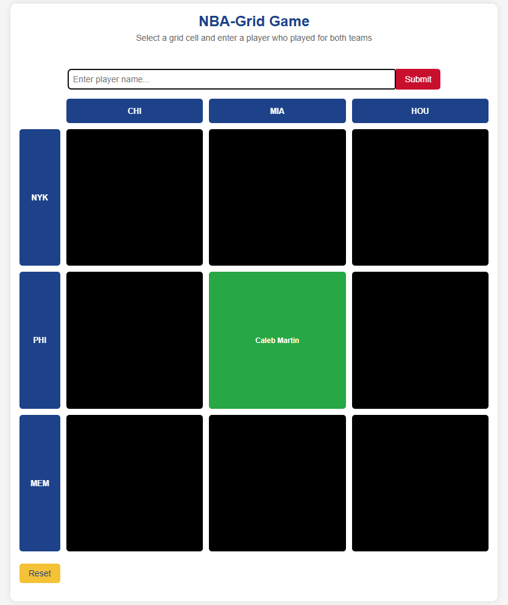

# NBA Team Grid Player Guess

A Python ([Eel](https://github.com/python-eel/Eel)) web project: guess a player who has played for both teams shown in the NBA grid row and column!

## Features

- NBA team grid: guess a player who played for both intersecting teams
- Uses [nba_api](https://github.com/swar/nba_api) for NBA player data
- Simple, interactive web UI

## Screenshot



## Installation

Install dependencies using your existing requirements file:

```bash
pip install -r requirements.txt

 
